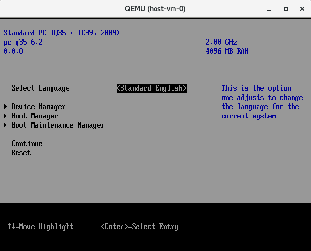
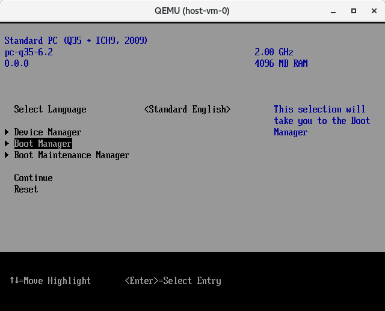
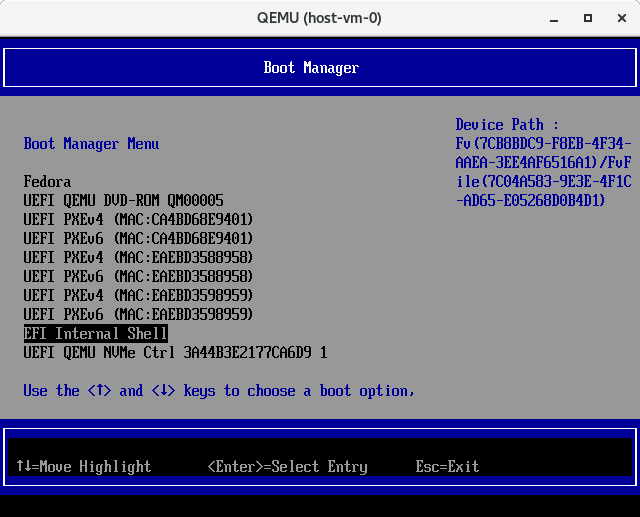
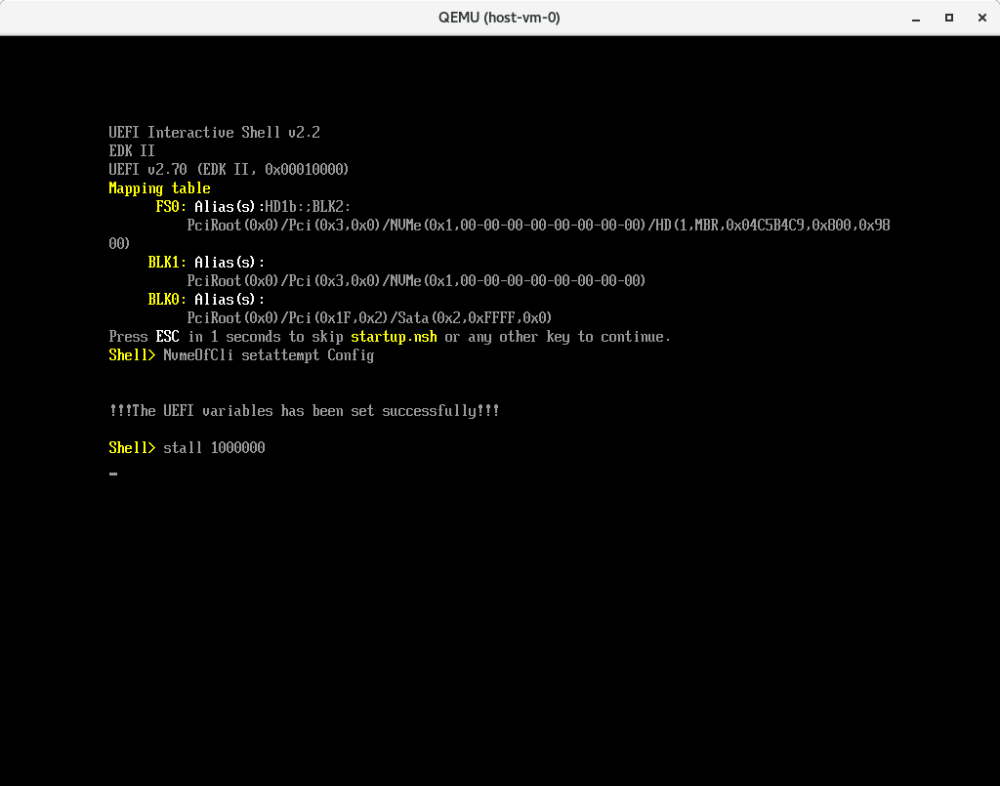
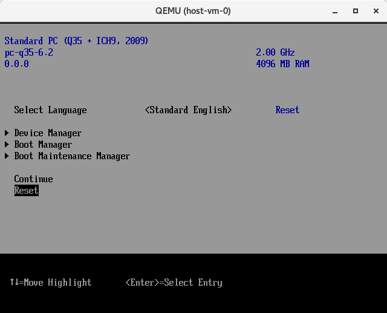
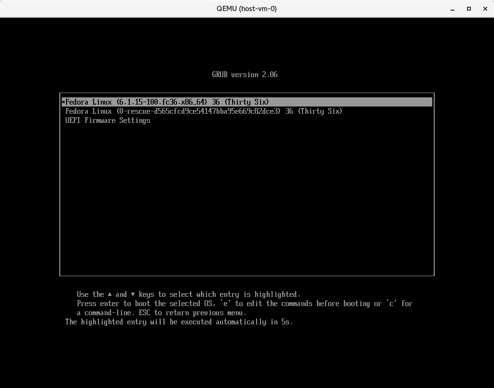
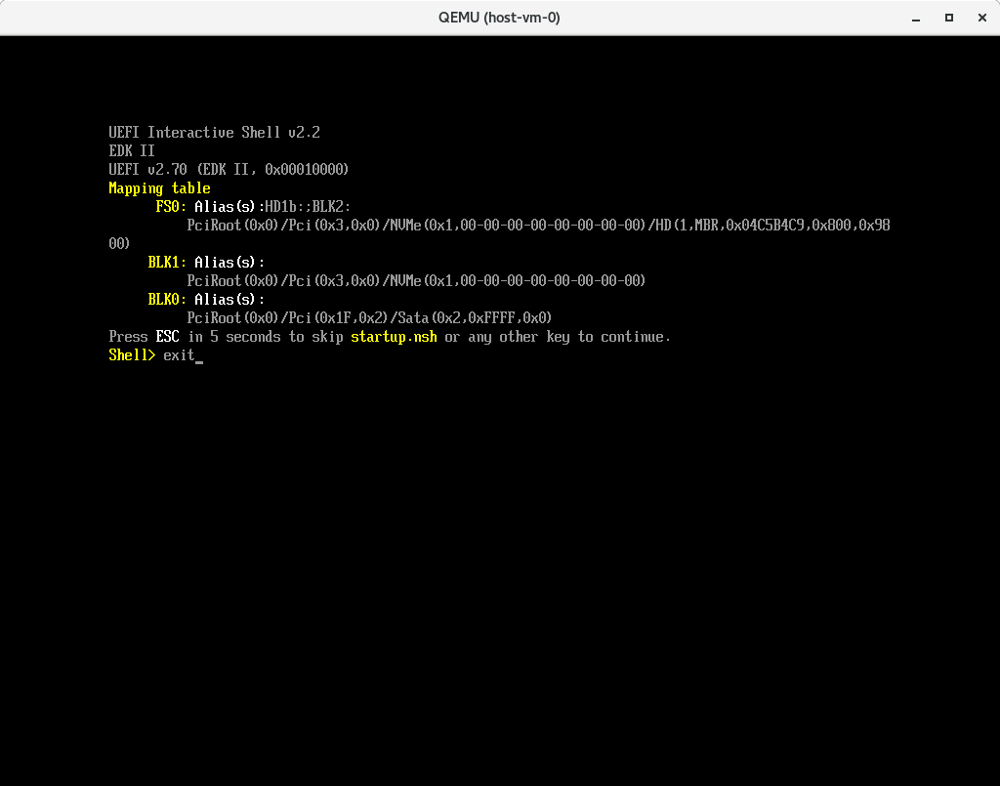

# The Red Hat NVMe/TCP Boot POC

This repository contains packages, scripts and instructions to assit in the set up and deployment of a QEMU based NVMe/TCP boot POC. The prerequisites for this POC include:

1. An X86_64 based hardware platform with 32GB of memory, 12 (VT-x) cores, at least 200GB of spare storage space.
2. A hardwired ethernet connection with access to a DHCP server and the public network.
3. A recent version of CentOS Stream 9, RHEL 9 or Fedora 36/37 installed on your host - this will be your hypervisor.
4. A user account with with [sudo](https://developers.redhat.com/blog/2018/08/15/how-to-enable-sudo-on-rhel#:~:text=DR%3A%20Basic%20sudo-,TL%3BDR%3A%20Basic%20sudo,out%20and%20back%20in%20again) access so you can administer the hypervisor.
5. (optional) A user account with [git](https://git-scm.com/book/en/v2/Getting-Started-First-Time-Git-Setup) configured so you modify code.
6. (optional) A valid github login with a [ssh key](https://docs.github.com/en/authentication/connecting-to-github-with-ssh/adding-a-new-ssh-key-to-your-github-account) configured
7. (optional) A valid [copr](https://docs.pagure.org/copr.copr/user_documentation.html#quick-start) account. This requires a [FAS](https://accounts.fedoraproject.org/) account.

This POC was developed on a [ThinkPad T Series
Laptop](https://www.lenovo.com/us/en/c/laptops/thinkpad/thinkpadt) using a
modified version of RHEL 8.7 with an [upstream QEMU
library](https://www.qemu.org/download/) installed. Note that the QEMU version
distributed with CensOS 9, RHEL 9 and RHEL 8 will not support this POC. It's
best to use a current version of Fedora for a hypervisor, if possible. To run
this POC on RHEL or Centos stream you must *deinstall* all libvirt and qemu
related RPMs and manually compile and install an upstream version of QEMU.
QEMU version 6.0 and 7.0 are supported.

*NOTE: Currently this POC has only been tested and proven to work with Fedora
36 and Fedora 37.  Support for Centos 9 and RHEL 9 are still TBD.*

*NOTE: The scripts used in this repository are all designed to be run from
a user account with sudo root access. It is not advised to run these scripts on
a production machine unless you know what you are doing. Some scripts will
modify the configuration of your host computer with sudo access by: installing
packages, creating networks, mounting and unmounting file systems and modifying
some configuration settings in `/etc` and `/usr/libexec`.*

# Quick Start with the prebuilt environment.

Run the following commands to download and install the *prebuilt* Timberland SIG NVMe/TCP Boot test environment:

```
  sudo dnf install -y git
  git clone https://github.com/timberland-sig/rh-linux-poc.git
  cd rh-linux-poc
  ./setup.sh net                 # this will modify your hypervisor network - run this only once
  ./setup.sh virt                # this will install QEMU (only on Fedora) - run this only once
  ./setup.sh prebuilt fedora-37  # this will download fedora-37 with all of the prebuilt Timberland-sig rpms and artifacts.
```

The next step is to go to [Setup your Virtual Machines](#setup-your-virtual-machines) and install the *host-vm*

# Developer Build

1. Create your user account, enable [sudo](https://developers.redhat.com/blog/2018/08/15/how-to-enable-sudo-on-rhel#:~:text=DR%3A%20Basic%20sudo-,TL%3BDR%3A%20Basic%20sudo,out%20and%20back%20in%20again) access, and configure your github [ssh-key](https://docs.github.com/en/authentication/connecting-to-github-with-ssh/adding-a-new-ssh-key-to-your-github-account).
2. Set up a [copr](https://docs.pagure.org/copr.copr/user_documentation.html#quick-start) user account and add [.config/copr](https://copr.fedorainfracloud.org/api/) to your user account.
3. Clone this repository with `git clone git@github.com:timberland-sig/rh-linux-poc.git`.
4. Create a working branch with `git checkout -b MYBRANCH` to keep configuration changes for your test bed.
5. Edit the *global_vars.sh* file and set the `COPR_USER` and `COPR_PROJECT` variables (c.f. `corp-cli whoami` and `corp-cli list`).

Now run the following commands to build and install your NVMe/TCP Boot test environment:

```
  ./setup.sh user                # this will validate your user account - run this multiple times
  ./setup.sh net                 # this will modify your hypervisor network - run this only once
  ./setup.sh virt                # this will install QEMU (only on Fedora) - run this only once
  ./setup.sh -m build fedora-37  # this will build all needed rpms and artifacts and create a fedora-37 bootable iso
```

The next step is to go to [Setup your Virtual Machines](#setup-your-virtual-machines) and install the *host-vm*.

# How it workis:

We create two Virtual Machines connected with two virtual networks.  The first
is a nvme/tcp soft target (*target-vm*), the second is a nvme/tcp host
(*host-vm*).  On the *host-vm* we will execute the UEFI firmware with QEMU. The
firmware will connect to the nvme1n1 device on the remote *target-vm* with nvme/tcp,
load the kernel, take over the boot process by using the information provided by the UEFI
firmware via the NBFT table.

```
                                         host-gw
           host-vm               -----------------------             target-vm
     ----------------------      |      hypervisor     |      -------------------------
     |     QEMU+UEFI      |      |                     |      |         QEMU          |
     |                 enp0s4 <--|--- br0 WAN (dhcp) --|--> enp0s4                    |
     |      nvme0n1       |      |                     |      |        nvme0n1        |
     |      EFIDISK       |      |                     |      |    target-vm rootfs   |
     |                    |      |                     |      |                       |
     |  NVMe/TCP host     |      |                     |      |     NVMe/TCP target   |
     |        |        enp0s5 <--| virbr1 LAN (static) |--> enp0s5        |           |
     |        |           |      |                     |      |           |           |
     |     nvme1n1     enp0s6 <--| virbr2 LAN (static) |--> enp0s6     nvme1n1        |
     |     rootfs         |      |                     |      |     host-vm rootfs    |
     |                    |      |                     |      |                       |
     ----------------------      |                     |      -------------------------
                                 -----------------------
```
# Directories and files

Directories and files are explained here:

| Directory | File  | Decription |
| :-----   | :----  | :----      |
| `nvme_rpm` |  -  | Contains the git submodule for https://github.com/timberland-sig/nvme-cli. The rpm is generated using this source code with the `nvme-cli.spec` file located in this directory. The code used to generate the rpm can be developed and changed by working in the provided *nvme_rpm/nvme-cli* git repository.  Normal git workflows apply. |
| nvme_rpm | nvme-cli.spec | A modified version of the Fedora nvme-cli.spec file from: https://src.fedoraproject.org/rpms/nvme-cli/blob/rawhide/f/nvme-cli.spec. This spec file has been modified to work with the timberland-sig nvme-cli source code in this submodule.
| `libnvme_rpm` | - | Contains the git submodule for https://github.com/timberland-sig/libnvme. The rpm is generated using this source code with the `libnvme.spec` file located in this directory. The code used to generate the rpm can be developed and changed by working in the provided *libnvme_rpm/libnvme* git repository.  Normal git workflows apply. |
| nvme_rpm | libnvm.spec | A modified version of the Fedora libnvme.spec file from: https://src.fedoraproject.org/rpms/libnvme/blob/rawhide/f/libnvme.spec. This spec file has been modified to work with the timberland-sig libnvme source code in this submodule.
| `dracut_rpm` | - | Contains the git submodule for https://github.com/timberland-sig/dracut. The rpm is generated using this source code with the `dracut.spec` file located in this directory. The code used to generate the rpm can be developed and changed by working in the provided *dracut_rpm/dracut* git repository.  Normal git workflows apply. |
| `dracut_rpm` | dracut.spec | A modified version of the Fedora dracut.spec file from:  https://src.fedoraproject.org/rpms/dracut/blob/rawhide/f/dracut.spec. This spec file has been modified to work with the timberland-sig dracut source code in this submodule. |
|  - | `global_vars.sh` | Contains global variables which control the test bed configuration. If you need to change sometihing, look here first. |
|  - | `rmp_lib.sh` | Contains global functions used by the scripts in the *libnvme_rpm*, *nvme_rpm*, and *dracut_rpm*  subdirectories. |
|  - | `vm_lib.sh` | Contains global functions used by the scripts in the *target-vm* and *host-vm* subdirectories. |
| `host-vm` | - |Contains the scripts and files needed to create and run your QEMU host virtual machine. |
| `target-vm` | - | Contains the scripts and files needed to create and run your QEMU target virtual machine. |

Proposed changes and patches should be sent to the repsective repositories at:
https://github.com/timberland-sig

# Getting Started

Step by step instructions for creating your QEMU Virtual Machines.

## Set up your Hypervisor

Run `./setup.sh user` - This script will install some prerequisite rpms and
validate that your user account is correctly configured.  If this script shows
an error. Correct the problem and run it again.

Run `./setup.sh net` - This will modify your hypervisor network configuration and
create three bridged networks. Run this script with caution because it will
change your network config.  You should not run this script from a remote shell
because the 'br0' network will be disconnected and reconfigured by this script.
It is best to run this script from the console login. When in doubt, configure
the bridged networks yourself, manually.`

| Network  | Decription |
| :-----   | :----      |
| `br0`    | A bridged public gateway network that requires DHCP  |
| `virbr1` | a virtual bridged network with the static address `192.168.101.1/24` |
| `virbr2` | a virtual bridged network with the static address `192.168.110.1/24` |

Run `./setup.sh virt` - This script will install the needed qemu-kvm packages
and change the permissions of `/etc/qemu/bridge.conf` and
`/usr/libexec/qemu-bridge-helper`. This will allow qemu to run from your user
account.

*Note: this only works with Fedora and should be run with caution. When in
doubt, install and setup qemu yourself, manually.*

Run `./setup.sh pkgs` - This script will install all needed rpms to complete your
dev/test environment.

## Build all Timberland-sig artifacts

Run `./setup.sh -m build fedora-37` - This script clones all of the timberland-sig
repositories, builds all needed artifiacts and rpms, and installs them in your
personal copr repo. It then to creates a bootable iso image with the
[lorax](https://weldr.io/lorax/lorax.html) uility. Artifacts and rpms are
created in the follow directories:

| Directory  | Decription |
| :-----   | :----      |
|`edk2`    | Contains the timberland-sig edk2 repository. The built artifacts are contained in: *edk2/edk2/Build/OvmfX64/DEBUG_GCC5/X64*.  The spefic artifacts need to boot with nvme/tcp are moved to: *host-vm/eficonfig/NvmeOfCli.efi*, *host-vm/OVMF_CODE.fd* and *host-vm/vm_vars.fd*. |
| `lorax_results` | contains the bootable iso generated from the build process. This iso is created using the generated rpm from your `copr.fedorainfracloud.org` project. The specific location of the iso is: *lorax_results/images/boot.iso*`.  This is the default iso used by the *host-vm\install.sh* and *target-vm\install.sh* scripts.|
| `copr.fedorainfracloud.org` | Contains rpms for nvme-cli, libnvme and dracut. (e.g.: see [johnmeneghini's](https://copr.fedorainfracloud.org/coprs/johnmeneghini/timberland-sig/) copr repository. |

# Setup your Virtual Machines

## The ./install.sh script

```
 Usage: install.sh <> ["qemu_args"]

 Creates qcow2 disk files and installs a QEMU VM named host-vm
 in the host-vm directory using the installation ISO provided in <iso_file>

 Note: the <iso_file> must be downloaded with "setup.sh prebuilt" first
 Note: pass "" in <iso_file> to use the default lorax_build

   E.g.:
          ./install.sh ""
          ./install.sh "" "-vnc :0"
          ./install.sh fedora-37 "-vnc :0"
          ./install.sh fedora-36
```

## Installing Fedora

Each QEMU VM (*host-vm* and *target-vm*) will need to be installed as a part of
the test bed setup.  During the installation processyou can use all of the
defaults for installation.  The only change in defaults needs be: *be sure to
create a root account with ssh access*.

| Fedora Install Step  | Action |
| :-----               | :----      |
| **Select Language**  | Click `Continue` |
| **This is unstable, pre-release software**  |  Click `I want to procced` |
| **Installation Destination** | The disk is pre-selected.  Simply Click `Done` |
| **Root Account** | Click `Enable root account` |
| enter Root Password | - [x] Allow root SSH login with password |
| **User Creation** | *Optional: Create a user account if wanted. All POC configuration will use the root account.* |
| final step | Click `Begin installation` |
| **INSTALLATION PROGRESS** | Click `Reboot System` when done|
| Complete the installation | It is important to wait for the VM to cleanly reboot in order to complete the installation. |

After the VM reboots login to the *root* account to be sure everything is
working. The VM should now be reachable through `enp0s4` which is the DHCP
controlled management network on the hypervisor's *br0* bridged network;
`enp0s5` and `enp0s6` are statically configured and unconnected. Use the `ip
-br addr show` and `nmcli dev status` commands to see if the networks are there
and correctly working.

## The ./netsetup.sh script

During the installation of both VMs the `./netsetup.sh` script will be
run.  This script will create a VM specific *netsetup.sh* configuration script and
`scp` it to the newly installed VM.  It is important to specify the `ifname` and
`ipaddr` parameters correctly.

```
 Usage: netsetup.sh <ifname2> <ifname3> <ipaddr>

 Creates creates a network configuration script called .build/netsetup.sh for host-vm

  ifname2  - second vm network interface device name (e.g. ens6)
           - corresponds to virbr1 on the hypervisor host
  ifname3  - third vm network interface device name (e.g. ens7)
           - corresponds to virbr2 on the hypervisor host
  ipaddr - dhcp assigned ipv4 address of host-vm
           - corresponds to br0 on the hypervisor host

 These valuse are obtains from "ip -br address show" after booting host-vm the first time

   E.g.:
          ./netsetup.sh enp0s5 enp0s6 192.168.0.63
          ./netsetup.sh enp0s5 enp0s6 10.16.188.66
```

## Create the host-vm

You need to `cd` to the *host-vm* directory to create your host virtual machine.

*Note that changing the specfic configuration - in terms of IP and MAC
addresses, HOSTNQNs, etc. can be done by modifying the *global_vars.sh* file.*

Also note that the scripts in the *host-vm* and *target-vm* directories are
context sensative. You can only run these scripts as: `./install.sh` or
`./start.sh` in the directory where they exist.


### Step 1 ./install.sh the host-vm

If your hypervisor is not on a remote system, you can use `./install.sh ""`.
Otherwise pass the `-vnc :` argment and connect to the VM console with
`vncviewer` on your local machine.

E.g:

```
./install.sh fedora-36

 Be sure to create the root account with ssh access.
 Reboot to complete the install and login to the root account.
 Record the host interface name and ip address with "ip -br address show" command.

 Next step will be to the "./netsetup.sh" script.
```

Install Fedora Follow the instructions on the screen and install Fedora on your *host-vm*.

After the installation reboot login to the root account on the host-vm and
display the network configuration.

For example:

```
[root@fedora ~]# ip -br addr show
lo               UNKNOWN        127.0.0.1/8 ::1/128
enp0s4           UP             192.168.0.216/24 2601:195:4000:62f:c84b:d6ff:fe8e:9401/64 fe80::c84b:d6ff:fe8e:9401/64
enp0s5           UP
enp0s6           UP
```

### Step 2 run ./netsetup.sh on the hypervisor

The `./netsetup.sh` utility is run on the hypervisor in the *host-vm*
directory.  Using the infromation from the `ip -br addr show` command on the
`host-vm`, run the `./netsetup.sh` utility.

For example:

```
 > ./netsetup.sh enp0s5 enp0s6 192.168.0.216

 creating .build/netsetup.sh

 creating .build/hosts.txt

 scp  .build/{netsetup.sh,hosts.txt} root@192.168.0.216:

Warning: Permanently added '192.168.0.216' (ECDSA) to the list of known hosts.
root@192.168.0.216's password:
netsetup.sh  100% 2190     5.5MB/s   00:00
hosts.txt    100%  228   821.3KB/s   00:00

 Login to host-vm/root and run "./netsetup.sh" to complete the VM configuration
```

### Step 3 run ./netsetup.sh on the host-vm

The newly created netsetup.sh script has been trasfered to the host-vm.  Now
login to the root account on the host-vm and run `./netsetup.sh`.

```
[root@fedora ~]# ./netsetup.sh
...
Enabling a Copr repository. Please note that this repository is not part
of the main distribution, and quality may vary.

The Fedora Project does not exercise any power over the contents of
this repository beyond the rules outlined in the Copr FAQ at
<https://docs.pagure.org/copr.copr/user_documentation.html#what-i-can-build-in-copr>,
and packages are not held to any quality or security level.

Please do not file bug reports about these packages in Fedora
Bugzilla. In case of problems, contact the owner of this repository.
Repository successfully enabled.
Copr repo for timberland-sig owned by johnmeneghini
...
dracut: *** Creating initramfs image file '/boot/initramfs-6.2.8-100.fc36.x86_64.img' done ***
...
 scp the efi.tgz file to the hypervisor host,
 or use "./copy_efi.sh" to retrieve efi.tgz
test@host-gw's password:
efi.tgz  100% 2996KB 236.1MB/s   00:00

 Shutdown this VM and run the "./create_efidisk.sh" script on the hypervisor.
 Then run the "target-vm/install.sh" script to create the target-vm.
```

What happened?

After configuring the virbr1 and virbr2 networks and installing all needed rpms
the following steps are taken on the `host-vm`:

```
# Update the network configuration
cat hosts.txt >> /etc/hosts

# Update the timberland-sig rpms
dnf copr enable -y johnmeneghini/timberland-sig
dnf install -y nvme-cli
dnf update -y dracut
dnf install -y dracut-network

# Build a new initramfs
dracut -f -v --add nvmf --add-drivers nvme-tcp

# Copy the updated /etc/boot/efi configuration
cd /boot
tar cvzf ~/efi.tgz efi

# scp the efi.tgz file to the hypervisor host
scp efi.tgz test@host-gw:/home/test/rh-linux-poc/host-vm/efi.tgz
```
### Step 4 run the ./create_efidisk.sh script

Run the `./create_efidisk.sh` script on the hypervisor. This script basically
creates a */boot/efi* vfat partiton in *efidisk* with the configuration from
the `host-vm` transfered in the `efi.tgz` file.  This partition is then
modified to include the following NBFT boot files.

* eficonfig/startup.nsh    - the NVMe-oF Boot startup file, used by NvmeOfCli.efi
* eficonfig/config         - the NVMe-oF Boot NBFT Attempt Configuration
* eficonfig/NvmeOfCli.efi  - the edk2 build artifact

The *efidisk* vfat partion is then used by qemu in the `.build/start.sh` script
with the paramter `-drive file=efidisk,format=raw,if=none,id=NVME1`.

The `./create_efidisk.sh` script does the following:

```
sudo losetup -D loop1
sudo losetup -P loop1 efidisk
sudo mkfs.vfat /dev/loop1p1
sudo losetup -D loop1
mkdir -p efi
sudo mount -t vfat -o loop,offset=1048576 efidisk efi
sudo tar xzvf efi.tgz
sudo cp -v eficonfig/* efi/EFI/BOOT
sudo umount efi
```

Example:

```
> ./create_efidisk.sh
'eficonfig/config.in' -> 'eficonfig/config'
'efidisk.in' -> 'efidisk'
[sudo] password for jmeneghi:
mkfs.fat 4.1 (2017-01-24)
efi/
efi/EFI/
efi/EFI/BOOT/
efi/EFI/BOOT/fbx64.efi
efi/EFI/BOOT/BOOTX64.EFI
efi/EFI/fedora/
efi/EFI/fedora/mmx64.efi
efi/EFI/fedora/shim.efi
efi/EFI/fedora/shimx64.efi
efi/EFI/fedora/grubx64.efi
efi/EFI/fedora/grub.cfg
efi/EFI/fedora/grub.cfg.rpmsave
efi/EFI/fedora/BOOTX64.CSV
'/home/jmeneghi/data/rh-linux-poc/host-vm/eficonfig/config' -> '/home/jmeneghi/data/rh-linux-poc/host-vm/efi/EFI/BOOT/config'
'/home/jmeneghi/data/rh-linux-poc/host-vm/eficonfig/startup.nsh' -> '/home/jmeneghi/data/rh-linux-poc/host-vm/efi/EFI/BOOT/startup.nsh'
'/home/jmeneghi/data/rh-linux-poc/host-vm/eficonfig/NvmeOfCli.efi' -> '/home/jmeneghi/data/rh-linux-poc/host-vm/efi/EFI/BOOT/NvmeOfCli.efi'
'/home/jmeneghi/data/rh-linux-poc/host-vm/eficonfig/VConfig.efi' -> '/home/jmeneghi/data/rh-linux-poc/host-vm/efi/EFI/BOOT/VConfig.efi'

 Next step is to install and configure the target-vm
 with "cd ../target-vm; ./install.sh"
```
To modify the NBFT Attempt Configuration simply edit the *eficonfig/config.in* config file.

### Step 5 shutdown the host-vm

This is a very important step. Before installing and confuring the `target-vm`
you must shutdown the `host-vm`.  After the `target-vm` is installed and
configured you will return to the *host-vm* directory and start the NBFT boot
process by running the *host-vm/start.sh* script.

## Create the target-vm

You must `cd ../target-vm` to run the scripts needed to start the `target-vm`.
The `target-vm` install script is slightly different because it doesn't require
the use of the pre-production `boot.iso`.

### Step 1 install the target-vm

By default the pre-production *boot.iso* can be used by specifying
`./install.sh ""`. Otherwise, you'll need to specify the same version of fedora as
shown above.

E.g.:

```
> ./install.sh fedora-36
using /data/jmeneghi/rh-linux-poc/ISO/Fedora-Everything-netinst-x86_64-36-1.5.iso
creating .build/install.sh
creating .build/start.sh

 Be sure to create the root account with ssh access.
 Reboot to complete the install and login to the root account.
 Then "shutdown -h now" the VM.

 Next step will be restart the VM with "./start.sh" script.
```

Follow the instructions on the screen by connecting to the VM console with
`vncviewer` (if needed) and complete the Fedora installation. Note: You can use all
of the defaults for installation, as before.  The only change in defaults needs
be: *be sure to create a root account with ssh access*.

After the installation reboot login to the root account on the target-vm and
`shutdown -h now` the VM.

### Step 2 start the target-vm

Now restart the `target-vm` by running the `./start.sh` script.

Example:

```
> ./start.sh

 Log into the root account and record the interface names for networks 2 and 3.
 Use the "ip -br address show" command to display interface names

 Next step will be to run the "./netsetup.sh" script.
```
### Step 3 login to the target-vm

Login to the root account on the target-vm and display the network configuration.

For example:

```
[root@fedora ~]# ip -br addr
lo               UNKNOWN        127.0.0.1/8 ::1/128
enp0s4           UP             192.168.0.63/24 2601:195:4000:62f:f67c:bf12:3bd0:f4bb/64 fe80::e1e:bd3c:3c79:cfbe/64
enp0s5           UP             fe80::6944:6969:83d:aef1/64
enp0s6           UP             fe80::6e22:d7dd:43f0:5e21/64
```

### Step 4 run ./netsetup.sh on the hypervisor

The `./netsetup.sh` utility is run on the hypervisor in the *target-vm*
directory.  Using the infromation from the `ip -br addr show` command on the
`target-vm`, run the `./netsetup.sh` utility.

For example:

```
> ./netsetup.sh enp0s5 enp0s6 192.168.0.63

 creating .build/netsetup.sh

 creating .build/hosts.txt

 scp  .build/{netsetup.sh,start-tcp-target.sh,hosts.txt,tcp.json} root@192.168.0.63:

root@192.168.0.63's password:
netsetup.sh         100% 1738     4.7MB/s   00:00
hosts.txt           100%  229   959.2KB/s   00:00
start-tcp-target.sh 100%  121   646.0KB/s   00:00
tcp.json            100% 2031    10.3MB/s   00:00

 Login to target-vm/root and run "./netsetup.sh" to complete the VM configuration
```

### Step 5 run ./netsetup.sh on the target-vm

For example:

```
[root@fedora ~]# ./netsetup.sh
Connection 'enp0s5' (76926070-72ca-467d-a3e2-53999c142020) successfully added.
Connection successfully activated (D-Bus active path: /org/freedesktop/NetworkManager/ActiveConnection/11)
Connection 'enp0s6' (b1b8419f-ace8-48fc-9297-88de304dc53a) successfully added.
Connection successfully activated (D-Bus active path: /org/freedesktop/NetworkManager/ActiveConnection/13)
lo               UNKNOWN        127.0.0.1/8 ::1/128
enp0s4           UP             192.168.0.63/24 2601:195:4000:62f:f67c:bf12:3bd0:f4bb/64 fe80::e1e:bd3c:3c79:cfbe/64
enp0s5           UP             192.168.101.20/24 fe80::22d1:a1a1:af9c:4447/64
enp0s6           UP             192.168.110.20/24 fe80::9d3e:e204:f858:a37/64
Enabling a Copr repository. Please note that this repository is not part
of the main distribution, and quality may vary.
.
.
.
 Run "./start-tcp-target.sh" to start the NVMe/TCP soft target.
 Then run "host-vm/start.sh" on the hypervisor to boot the host-vm with NVMe/TCP
```

### Step 6 run start-tcp-target.sh on the target-vm

The following step configures and runs the NVMe/TCP softarget on the
`target-vm`.  Following this step the `target-vm` is now serving the
`host-vm's` boot disk through nvme-tcp.

Example:

```
[root@fedora ~]# ./start-tcp-target.sh
[  570.563169] nvmet: adding nsid 1 to subsystem nqn.2014-08.org.nvmexpress:uuid:0c468c4d-a385-47e0-8299-6e95051277db
[  570.564014] nvmet_tcp: enabling port 1 (192.168.101.20:4420)
[  570.564289] nvmet_tcp: enabling port 2 (192.168.110.20:4420)
Redirecting to /bin/systemctl stop firewalld.service
```

## Start the host-vm

Now `cd ../host-vm` and run the `./start.sh attempt` script to start the host-vm and
begin the NVMe/TCP NBFT boot process.

E.g.:

```
> ./start.sh
 Usage: ./start.sh <attempt|remote|local>

 Starts the QEMU VM named host-vm

    attempt - inialize vm_vars.fd and boot with efidisk and nvme/tcp - target-vm must be running
    remote  - do not initialized vm_vars.fd and boot with efidisk and nvme/tcp - target-vm must be running
    local -  boot with out the efidisk and mount the remote disk locally - target-vm must be shutdown

   E.g.:
          ./start.sh attempt
          ./start.sh remote
          ./start.sh local
```

The first time the host-vm is started you need to program the nbft which is programmed by boot variables held in the `vm_vars.fd` file.  This file is initialized by using the *attempt* arguments.

Once you connect to the `host-vm` console, you will observe the UEFI boot
process starting.  Immediately Press the ESC button to enter the UEFI setup
menu.



Select the Boot Manager.



Select the EFI Internal Shell and hit `Enter`.



The EFI Internal Shell will run and `NvmeOfCli setattempt Config` will run.
Allow the coutdown to expire so that `startup.nsh` runs.  This only needs to be
done once. This will program your NBFT/ACPI table with the information
programmed in the *host-vm/eficonfig/config* attempt file.



After `!!!The UEFI variables has been set successfully!!!` the EFI Shell will
return to the Boot Manager menu. Press ESC and select `Reset` to continue.



The EFI firmware will reset the system an boot from NVMe/TCP.



## To Restart the host-vm

**To restart the host-vm after shutdown -h**

Subsequent to booting the *host-vm* for the first time the NBFT/ACPI table
should not need to be programmed by running `startup.nsh` again. To boot the
*host-vm* after shutdown run the `./start.sh remote` script. Connect to the
*host-vm* console and immediately press the ESC button to stop the
`startup.nsh` countdown. If needed, type `reset -w` at the *Shell>* prompt to
do a warm restart.  The host-vm should immediately find the remote disk and
boot with nvme/tcp.



Then Enter `Reset` at the UEFI setup menu to boot the VM. The UEFI will connect
to the NVMe/TCP target and boot.


## To Reprogram or update the efidisk on the host-vm

Now that you have both the *host-vm* and the *target-vm* running you can update the *nvme-cli*, *libnvme* and *dracut* components with the following work flow.

1. Modify the source code in the git submodules found in *libnvme_rpm/libnvme*, *nvme_rpm/nvme-cli*, or *dracut_rpm/dracut*.
2. After compiling your changes locally generate new *copr* rpms with the `./setup.sh copr` command.

Then update your running QEMU testbed with the new new *rpms* with the following prodedure.

1. shutdown the host-vm
2. shutdown the target-vm
3. start the host-vm with `host-vm/start.sh local`
4. login to the vm and run the `./update_efi.sh` script.
5. run the `host-vm/copy_efi.sh` script, if needed.
6. shutdown the host-vm
6. start the target-vm with the `target-vm/start.sh` script
6. start the nvme target on the target-vm with the `./start-nvme-target.sh` script
7. create a new *efidisk* by running the `host-vm/create_efidisk.sh` script
8. boot the host-vm with the `host-vm/start.sh attempt` script

This procedure can be used to develop and test your changes to *nvme-cli* and *dracut* in support of NVMe/TCP boot.

**END**
