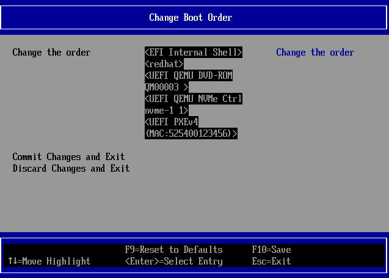
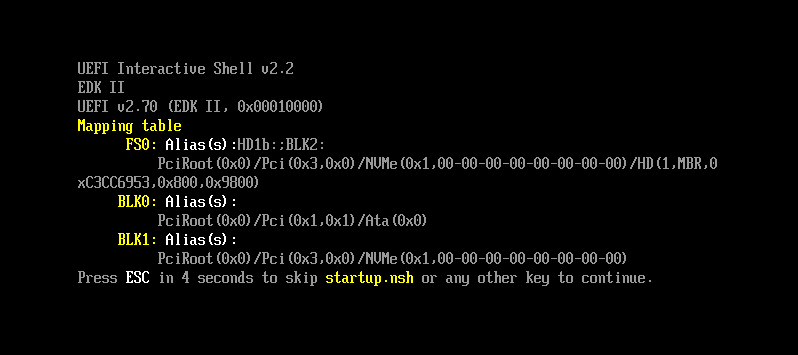
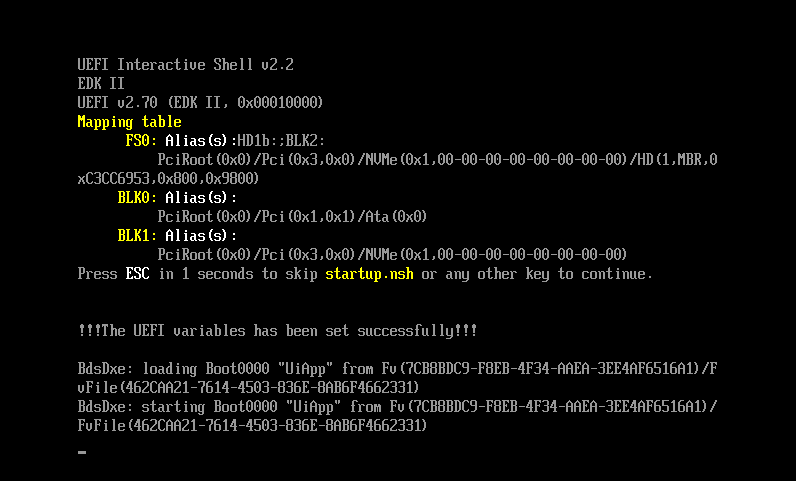

# The Red Hat NVMe/TCP Boot POC

This repository contains packages, scripts and instructions to assit in the set up and deployment of a QEMU based NVMe/TCP boot POC. The prerequisites for this POC include:

1. An X86_64 based hardware platform with 32GB of memory, 12 (VT-x) cores, at least 200GB of spare storage space.
2. A hardwired ethernet connection with access to a DHCP server and the public network.
3. A recent version of CentOS Stream 9, RHEL 9 or Fedora 36/37 installed on your host - this will be your hypervisor.
4. A user account with [git](https://git-scm.com/book/en/v2/Getting-Started-First-Time-Git-Setup) configured and root access so you can administer the hypervisor.
5. A valid [copr](https://docs.pagure.org/copr.copr/user_documentation.html#quick-start) account. This requires a [FAS](https://accounts.fedoraproject.org/) account.
6. A valid github login with a [ssh key](https://docs.github.com/en/authentication/connecting-to-github-with-ssh/adding-a-new-ssh-key-to-your-github-account) configured

*NOTE: The scripts included in this repository are all designed to be run from
a user account with sudo root access. It is not advised to run these scripts on
a production machine unless you know what you are doing. Some scripts will
modify the configuration of your host computer with sudo access by: installing
packages, creating networks, mounting and unmounting file systems and modifying
some configuration settings in `/etc` and `/usr/libexec`.*

This POC was developed on a [ThinkPad T Series
Laptop](https://www.lenovo.com/us/en/c/laptops/thinkpad/thinkpadt) using a
modified version of RHEL 8.7 with an [upstream QEMU
library](https://www.qemu.org/download/) installed. Note that the QEMU version
distributed with CensOS 9, RHEL 9 and RHEL 8 will not support this POC. It's
best to use a current version of Fedora for a hypervisor, if possible. To run
this POC on RHEL or Centos stream you must *deinstall* all libvirt and qemu
related RPMs and manually compile and install an upstream version of QEMU.
QEMU version 6.0 and 7.0 are supported.

*NOTE: Currently this POC has only been tested and proven to work with Fedora
36 and Fedora 37.  Support for Centos 9 and RHEL 9 are still TBD.*

# Quick start

1. Create your user account, enable [sudo](https://developers.redhat.com/blog/2018/08/15/how-to-enable-sudo-on-rhel#:~:text=DR%3A%20Basic%20sudo-,TL%3BDR%3A%20Basic%20sudo,out%20and%20back%20in%20again) access, and configure your github [ssh-key](https://docs.github.com/en/authentication/connecting-to-github-with-ssh/adding-a-new-ssh-key-to-your-github-account).
2. Set up a [copr](https://docs.pagure.org/copr.copr/user_documentation.html#quick-start) user account and add [.config/copr](https://copr.fedorainfracloud.org/api/) to your user account.
3. Clone this repository with `git clone git@github.com:timberland-sig/rh-linux-poc.git`.
4. Create a working branch with `git checkout -b MYBRANCH` to keep configuration changes for your test bed.
5. Edit the *global_vars.sh* file and set the `COPR_USER` and `COPR_PROJECT` variables (c.f. `corp-cli whoami` and `corp-cli list`).

Now run the following commands to build and install your NVMe/TCP Boot test environment:

```
  ./setup.sh user                # this will validate your user account - run this multiple times
  ./setup.sh net                 # this will modify your hypervisor network - run this only once
  ./setup.sh virt                # this will install QEMU (only on Fedora) - run this only once
  ./setup.sh build -m fedora-37  # this will build all needed rpms and artifacts and create a fedora-37 bootable iso
  pushd host-vm                  # change directories
  ./install.sh "" "-vnc :0"      # creates and installs the QEMU host-vm (-vnc is optional)
  ./netsetup.sh                  # configures the QEMU host-vm
  ./create_efidisk.sh            # creates the boot/efi partition
  pushd ../target-vm             # change directories
  ./install.sh "-vnc :1"         # creates and installs the target-vm
  ./start.sh                     # starts the targe-vm
  ./netsetup.sh                  # configures the target-vm network
  popd                           # change directories back to the host-vm
  ./start.sh                     # starts the host-vm with NVMe/TCP boot
```
# How does it work:

We create two Virtual Machines connected with two virtual networks.  The first
is a nvme/tcp soft target (*target-vm*), the second is a nvme/tcp host
(*host-vm*).  On the *host-vm* we will execute the UEFI firmware with QEMU. The
firmware will connect to the nvme1n1 device on the remote *target-vm* with nvme/tcp,
load the kernel, take over the boot process by using the information provided by the UEFI
firmware via the NBFT table.

```
                                         host-gw
           host-vm               -----------------------             target-vm
     ----------------------      |      hypervisor     |      -------------------------
     |     QEMU+UEFI      |      |                     |      |         QEMU          |
     |                 enp0s4 <--|--- br0 WAN (dhcp) --|--> enp0s4                    |
     |      nvme0n1       |      |                     |      |        nvme0n1        |
     |      EFIDISK       |      |                     |      |    target-vm rootfs   |
     |                    |      |                     |      |                       |
     |  NVMe/TCP host     |      |                     |      |     NVMe/TCP target   |
     |        |        enp0s5 <--| virbr1 LAN (static) |--> enp0s5        |           |
     |        |           |      |                     |      |           |           |
     |     nvme1n1     enp0s6 <--| virbr2 LAN (static) |--> enp0s6     nvme1n1        |
     |     rootfs         |      |                     |      |     host-vm rootfs    |
     |                    |      |                     |      |                       |
     ----------------------      |                     |      -------------------------
                                 -----------------------
```

## Set up your Hypervisor

Run `./setup.sh user` - This script will install some prerequisite rpms and
validate that your user account is correctly configured.  If this script shows
an error. Correct the problem and run it again.

Run `./setup.sh net` - This will modify your hypervisor network configuration and
create three bridged networks. Run this script with caution because it will
change your network config.  You should not run this script from a remote shell
because the 'br0' network will be disconnected and reconfigured by this script.
It is best to run this script from the console login. When in doubt, configure
the bridged networks yourself, manually.`

| Network  | Decription |
| :-----   | :----      |
| `br0`    | A bridged public gateway network that requires DHCP  |
| `virbr1` | a virtual bridged network with the static address `192.168.101.1/24` |
| `virbr2` | a virtual bridged network with the static address `192.168.110.1/24` |

Run `./setup.sh virt` - This script will install the needed qemu-kvm packages
and change the permissions of `/etc/qemu/bridge.conf` and
`/usr/libexec/qemu-bridge-helper`. This will allow qemu to run from your user
account.

*Note: this only works with Fedora and should be run with caution. When in
doubt, install and setup qemu yourself, manually.*

Run `./setup.sh pkgs` - This script will install all needed rpms to complete your
dev/test environment.

## Build all Timberland-sig artifacts

Run `./setup.sh -m build fedora-37` - This script clones all of the timberland-sig
repositories, builds all needed artifiacts and rpms, and installs them in your
personal copr repo. It then to creates a bootable iso image with the
[lorax](https://weldr.io/lorax/lorax.html) uility. Artifacts and rpms are
created in the follow directories:

| Directory  | Decription |
| :-----   | :----      |
|`edk2`    | Contains the timberland-sig edk2 repository. The built artifacts are contained in: *edk2/edk2/Build/OvmfX64/DEBUG_GCC5/X64*.  The spefic artifacts need to boot with nvme/tcp are moved to: *host-vm/eficonfig/NvmeOfCli.efi*, *host-vm/OVMF_CODE.fd* and *host-vm/vm_vars.fd*. |
| `lorax_results` | contains the bootable iso generated from the build process. This iso is created using the generated rpm from your `copr.fedorainfracloud.org` project. The specific location of the iso is: *lorax_results/images/boot.iso*`.  This is the default iso used by the *host-vm\install.sh* and *target-vm\install.sh* scripts.|
| `copr.fedorainfracloud.org` | Contains rpms for nvme-cli, libnvme and dracut. (e.g.: see [johnmeneghini's](https://copr.fedorainfracloud.org/coprs/johnmeneghini/timberland-sig/) copr repository. |

Other directories and files are explained here:

| Directory  | Decription |
| :-----   | :----      |
| `nvme_rpm` |  Contains the git submodule for https://github.com/timberland-sig/nvme-cli. The rpm is generated using this source code with the `nvme-cli.spec` file located in this directory. The code used to generate the rpm can be developed and changed by working in the provided *nvme_rpm/nvme-cli* git repository.  Normal git workflows apply. |
| `libnvme_rpm` | Contains the git submodule for https://github.com/timberland-sig/libnvme. The rpm is generated using this source code with the `libnvme.spec` file located in this directory. The code used to generate the rpm can be developed and changed by working in the provided *libnvme_rpm/libnvme* git repository.  Normal git workflows apply. |
| `dracut_rpm` | Contains the git submodule for https://github.com/timberland-sig/dracut. The rpm is generated using this source code with the `dracut.spec` file located in this directory. The code used to generate the rpm can be developed and changed by working in the provided *dracut_rpm/dracut* git repository.  Normal git workflows apply. |
| `global_vars.sh` | Contains global variables which control the test bed configuration. If you need to change sometihing, look here first. |
| `host-vm` | Contains the scripts and files needed to create and run your QEMU host virtual machine. |
| `target-vm` | Contains the scripts and files needed to create and run your QEMU target virtual machine. |

Proposed changes and patches should be sent to the repsective repositories at:
https://github.com/timberland-sig

## Installing Fedora

Each QEMU VM (*host-vm* and *target-vm*) will need to be installed as a part of
the test bed setup.  During the installation processyou can use all of the
defaults for installation.  The only change in defaults needs be: *be sure to
create a root account with ssh access*.

| Fedora Install Step  | Action |
| :-----               | :----      |
| **Select Language**  | Click `Continue` |
| **This is unstable, pre-release software**  |  Click `I want to procced` |
| **Installation Destination** | The disk is pre-selected.  Simply Click `Done` |
| **Root Account** | Click `Enable root account` |
| enter Root Password | - [x] Allow root SSH login with password |
| **User Creation** | *Optional: Create a user account if wanted. All POC configuration will use the root account.* |
| final step | Click `Begin installation` |
| **INSTALLATION PROGRESS** | Click `Reboot System` when done|
| Complete the installation | It is important to wait for the VM to cleanly reboot in order to complete the installation. |

After the VM reboots login to the *root* account to be sure everything is
working. The VM should now be reachable through `enp0s4` which is the DHCP
controlled management network on the hypervisor's *br0* bridged network;
`enp0s5` and `enp0s6` are statically configured and unconnected. Use the `ip
-br addr show` and `nmcli dev status` commands to see if the networks are there
and correctly working.

## The ./netsetup.sh script

During the installation of both VMs the `./netsetup.sh` script will be
run.  This script will create a VM specific *netsetup.sh* configuration script and
`scp` it to the newly installed VM.  It is important to specify the `ifname` and
`ipaddr` parameters correctly.

```
 Usage: netsetup.sh <ifname2> <ifname3> <ipaddr>

 Creates creates a network configuration script called .build/netsetup.sh for host-vm

  ifname2  - second vm network interface device name (e.g. ens6)
           - corresponds to virbr1 on the hypervisor host
  ifname3  - third vm network interface device name (e.g. ens7)
           - corresponds to virbr2 on the hypervisor host
  ipaddr - dhcp assigned ipv4 address of the host-vm or target-vm
           - corresponds to br0 on the hypervisor host

 These valuse are obtains from "ip -br address show" after booting host-vm the first time

   E.g.:
          ./netsetup.sh ens6 ens7 192.168.0.154
```

# Step by Step Instructions

## Create the host-vm

You need to `cd` to the *host-vm* directory to create your host virtual machine.

*Note that changing the specfic configuration - in terms of IP and MAC
addresses, HOSTNQNs, etc. can be done by modifying the *global_vars.sh* file.*

Also note that the scripts in the *host-vm* and *target-vm* directories are
context sensative. You can only run these scripts as: `./install.sh` or
`./start.sh` in the directory where they exist.

### The host-vm ./install.sh script
```
 Usage: install.sh <"qemu_args">

 Creates qcow2 disk files and installs a QEMU VM named host-vm

 Note: if no qemu argument is needed pass ""

   E.g.:
          ./install.sh ""
          ./install.sh "-vnc :1"
```

### Step 1 ./install.sh the host-vm

If your hypervisor is not on a remote system, you can use `./install.sh ""`.
Otherwise pass the `-vnc :` argment and connect to the VM console with
`vncviewer` on your local machine.

E.g:

```
rhel-storage-105:host-vm(john_fix_7) > ./install.sh "-vnc :1"
 using /home/test/rh-linux-poc/lorax_results/images/boot.iso
 creating host-vm disk
 using /home/test/rh-linux-poc/target-vm/disks/nvme2.qcow2
 creating .build/install.sh
 creating .build/start.sh

Connect with "vncviewer rhel-storage-105.storage.lab.eng.bos.redhat.com:1"

 Be sure to create the root account with ssh access.
 Reboot to complete the install and login to the root account.
 Record the host interface name and ip address with "ip -br address show" command.

 Next step will be to the "./netsetup.sh" script.
```

Follow the instructions on the screen by connecting to the VM console with
`vncviewer` and complete the Fedora installation.

After the installation reboot login to the root account on the host-vm and
display the network configuration.

For example:

```
[root@dhcp-189-65 ~]# ip -br addr show
lo               UNKNOWN        127.0.0.1/8 ::1/128
enp0s4           UP             10.16.189.65/23 2620:52:0:10bc:c84b:d6ff:fe8e:9401/64 fe80::c84b:d6ff:fe8e:9401/64
enp0s5           UP             fe80::e8eb:d3ff:fe58:8958/64
enp0s6           UP             fe80::e8eb:d3ff:fe59:8959/64
```

### Step 2 run ./netsetup.sh on the hypervisor

The `./netsetup.sh` utility is run on the hypervisor in the *host-vm*
directory.  Using the infromation from the `ip -br addr show` command on the
`host-vm`, run the `./netsetup.sh` utility.

For example:

```
rhel-storage-105:host-vm(john_fix_7) > ./netsetup.sh enp0s5 enp0s6 10.16.189.65

 creating .build/netsetup.sh

 creating .build/hosts.txt

 scp  .build/{netsetup.sh,hosts.txt} root@10.16.189.65:
root@10.16.189.65's password:
netsetup.sh 100% 2108     3.4MB/s   00:00
hosts.txt   100%  229   750.1KB/s   00:00

 Login to host-vm/root and run "./netsetup.sh" to complete the VM configuration
```

### Step 3 run ./netsetup.sh on the host-vm

The newly created netsetup.sh script has been trasfered to the host-vm.  Now
login to the root account on the host vm and run `./netconfig.sh`.

```
[root@dhcp-189-65 ~]# ls
anaconda-ks.cfg  hosts.txt  netsetup.sh
[root@dhcp-189-65 ~]# ./netsetup.sh
Connection 'enp0s5' (4fc123d1-d816-3f4b-8a3b-e53f9aff6075) successfully deleted.
Connection 'enp0s5' (b651d475-5c77-4a76-9081-160ad260844e) successfully added.
Connection successfully activated (D-Bus active path: /org/freedesktop/NetworkManager/ActiveConnection/5)
Connection 'enp0s6' (e7bf6983-9020-35ec-96c5-5bb301d66399) successfully deleted.
Connection 'enp0s6' (7fced882-b0b4-4b48-83b2-f114283959fd) successfully added.
Connection successfully activated (D-Bus active path: /org/freedesktop/NetworkManager/ActiveConnection/7)
lo               UNKNOWN        127.0.0.1/8 ::1/128
enp0s4           UP             10.16.189.65/23 2620:52:0:10bc:c84b:d6ff:fe8e:9401/64 fe80::c84b:d6ff:fe8e:9401/64
enp0s5           UP             192.168.101.30/24 fe80::6bd:ea16:6f64:a4ae/64
enp0s6           UP             192.168.110.30/24 fe80::dc88:d535:8342:810e/64
.
.
.
dracut: *** Creating initramfs image file '/boot/initramfs-6.1.14-200.fc37.x86_64.img' done ***
/boot ~
efi/
efi/EFI/
efi/EFI/BOOT/
efi/EFI/BOOT/fbx64.efi
efi/EFI/BOOT/BOOTX64.EFI
efi/EFI/fedora/
efi/EFI/fedora/mmx64.efi
efi/EFI/fedora/shim.efi
efi/EFI/fedora/shimx64.efi
efi/EFI/fedora/grubx64.efi
efi/EFI/fedora/grub.cfg
efi/EFI/fedora/grub.cfg.rpmsave
efi/EFI/fedora/BOOTX64.CSV
~
 scp the efi.tgz file to the hypervisor host
test@host-gw's password:
efi.tgz  100% 2996KB 236.1MB/s   00:00

 Please shutdown this VM and run the "./create_efidisk.sh" script.
```

What happened?

After configuring the virbr1 and virbr2 networks and installing all needed rpms
the following steps are taken on the `host-vm`:

```
# Update the network configuration
cat hosts.txt >> /etc/hosts

# Update the timberland-sig rpms
dnf copr enable -y johnmeneghini/timberland-sig
dnf install -y nvme-cli
dnf update -y dracut
dnf install -y dracut-network

# Build a new initramfs
dracut -f -v --add nvmf

# Copy the updated /etc/boot/efi configuration
cd /boot
tar cvzf ~/efi.tgz efi

# scp the efi.tgz file to the hypervisor host
scp efi.tgz test@host-gw:/home/test/rh-linux-poc/host-vm/efi.tgz
```
### Step 4 run the ./create_efidisk.sh script

Run the `./create_efidisk.sh` script on the hypervisor. This script basically
creates a */boot/efi* vfat partiton in *efidisk* with the configuration from
the `host-vm` transfered in the `efi.tgz` file.  This partition is then
modified to include the following NBFT boot files.

* eficonfig/startup.nsh    - the NVMe-oF Boot startup file, used by NvmeOfCli.efi
* eficonfig/config         - the NVMe-oF Boot NBFT Attempt Configuration
* eficonfig/NvmeOfCli.efi  - the edk2 build artifact

The *efidisk* vfat partion is then used by qemu in the `.build/start.sh` script
with the paramter `-drive file=efidisk,format=raw,if=none,id=NVME1`.

The `./create_efidisk.sh` script does the following:

```
sudo losetup -D loop1
sudo losetup -P loop1 efidisk
sudo mkfs.vfat /dev/loop1p1
sudo losetup -D loop1
mkdir -p efi
sudo mount -t vfat -o loop,offset=1048576 efidisk efi
sudo tar xzvf efi.tgz
sudo cp -v eficonfig/* efi/EFI/BOOT
sudo umount efi
```

To modify the NBFT Attempt Configuration simply edit the *eficonfig/config.in* config file.

### Step 5 shutdown the host-vm

This is a very important step. Before installing and confuring the `target-vm`
you must shutdown the `host-vm`.  After the `target-vm` is installed and
configured you will return to the *host-vm* directory and start the NBFT boot
process by running the *host-vm/start.sh* script.

## Create the target-vm

You must `cd ../target-vm` to run the scripts needed to start the `target-vm`.
The `target-vm` install script is slightly different because it doesn't require
the use of the pre-production `boot.iso`.

### The target-vm ./install.sh script

```
 Usage: install.sh <iso_file> ["qemu_args"]

 Creates qcow2 disk files and installs a QEMU VM named target-vm
 in /home/test/rh-linux-poc/target-vm using the installation ISO provided in <iso_file>

 Note: iso_file must be contain the full iso file location
 Note: pass iso_file "" to use the default

   E.g.:
          ./install.sh ""
          ./install.sh "" "-vnc :0"
          ./install.sh /root/rh-linux-poc/images/boot.iso "-vnc :0"
          ./install.sh /home/jmeneghi/rh-linux-poc/lorax_results/mages/boot.iso
          ./install.sh /data/jmeneghi/ISO/Fedora-Server-dvd-x86_64-37-1.7.iso
```

### Step 1 install the target-vm

By default the pre-production *boot.iso* can be used by specifying
`./install.sh ""`. Otherwise, you'll need to download your own *.iso* file as
shown above.

E.g.:

```
rhel-storage-105:target-vm(john_fix_7) > ./install.sh "" "-vnc :0"
using /home/test/rh-linux-poc/lorax_results/images/boot.iso
/usr/bin/qemu-system-x86_64
creating .build/install.sh
creating .build/start.sh

Connect with "vncviewer rhel-storage-105.storage.lab.eng.bos.redhat.com:0"

 Be sure to create the root account with ssh access.
 Reboot to complete the install and login to the root account.
 Then "shutdown -h now" the VM.

 Next step will be restart the VM with "./start.sh" script.
```

Follow the instructions on the screen by connecting to the VM console with
`vncviewer` (if needed) complete the Fedora installation. Note: You can use all
of the defaults for installation, as before.  The only change in defaults needs
be: *be sure to create a root account with ssh access*.

After the installation reboot login to the root account on the target-vm and
`shutdown -h now` the VM.

### Step 2 start the target-vm

Now restart the `target-vm` by running the `./start.sh` script.

```
rhel-storage-105:target-vm(john_fix_7) > ./start.sh

Connect with "vncviewer rhel-storage-105.storage.lab.eng.bos.redhat.com:0"
```
### Step 3 login to the target-vm

Login to the root account on the target-vm and display the network configuration.

For example:

```
[root@dhcp16-189-66 ~]# ip -br addr
lo               UNKNOWN        127.0.0.1/8 ::1/128
enp0s4           UP             10.16.189.66/23 2620:52:0:10bc:c4b8:6c09:d6c1:19e/64 fe80::520c:b9ea:1dc2:7f22/64
enp0s5           UP             fe80::de59:aa0a:80fb:fb54/64
enp0s6           UP             fe80::4fd6:b9ca:87cc:c0d9/64
```

### Step 4 run ./netsetup.sh on the hypervisor

The `./netsetup.sh` utility is run on the hypervisor in the *target-vm*
directory.  Using the infromation from the `ip -br addr show` command on the
`target-vm`, run the `./netsetup.sh` utility.

For example:

```
rhel-storage-105:target-vm(john_fix_7) > ./netsetup.sh enp0s5 enp0s6 10.16.189.66

 creating .build/netsetup.sh

 creating .build/hosts.txt

 scp  .build/{netsetup.sh,start-tcp-target.sh,hosts.txt,tcp.json} root@10.16.189.66:

root@10.16.189.66's password:
netsetup.sh           100% 1666     2.9MB/s   00:00
hosts.txt             100%  231   749.8KB/s   00:00
start-tcp-target.sh   100%  121   337.0KB/s   00:00
tcp.json              100% 2030     5.2MB/s   00:00

 Login to target-vm/root and run "./netsetup.sh" to complete the VM configuration

```

### Step 5 run ./netsetup.sh on the target-vm

```
[root@dhcp16-189-66 ~]# ls
anaconda-ks.cfg  hosts.txt  netsetup.sh  tcp.json  tcp-target.sh
[root@dhcp16-189-66 ~]# ./netsetup.sh
Connection 'Wired connection 2' (9ccf9b21-9a75-30c8-aae2-3ec5cb406e2c) successfully deleted.
Connection 'enp0s5' (ecd0f138-6ea7-4199-879a-99090877ad40) successfully added.
Connection successfully activated (D-Bus active path: /org/freedesktop/NetworkManager/ActiveConnection/5)
Connection 'Wired connection 3' (7711dabb-1f71-3a6a-877e-7a6e68abd47d) successfully deleted.
Connection 'enp0s6' (f502f207-6fd8-4422-b5d3-53dedbd38ad6) successfully added.
Connection successfully activated (D-Bus active path: /org/freedesktop/NetworkManager/ActiveConnection/7)
lo               UNKNOWN        127.0.0.1/8 ::1/128
enp0s4           UP             10.16.189.66/23 2620:52:0:10bc:c4b8:6c09:d6c1:19e/64 fe80::520c:b9ea:1dc2:7f22/64
enp0s5           UP             192.168.101.20/24 fe80::dba9:a0ab:f3a5:394f/64
enp0s6           UP             192.168.110.20/24 fe80::5961:dc0a:6f92:4a70/64
.
.
.
```

### Step 6 run start-tcp-target.sh on the target-vm

The following step configures and runs the NVMe/TCP softarget on the
`target-vm`.  Following this step the `target-vm` is now serving the
`host-vm's` boot disk through nvme-tcp.

```
[root@dhcp16-189-66 ~]# ./start-tcp-target.sh
[ 1473.611529] nvmet: adding nsid 1 to subsystem nqn.2014-08.org.nvmexpress:uuid:0c468c4d-a385-47e0-8299-6e95051277db
[ 1473.612700] nvmet_tcp: enabling port 1 (192.168.101.20:4420)
[ 1473.613096] nvmet_tcp: enabling port 2 (192.168.110.20:4420)
Redirecting to /bin/systemctl stop firewalld.service
```

To verify this working run the `./discover_target.sh` command in the *host-vm* dirctory.
following command from the hypervisor.

E.g.:

```
rhel-storage-105:host-vm(john_fix_7) > ./discover_target.sh

Discovery Log Number of Records 2, Generation counter 3
=====Discovery Log Entry 0======
trtype:  tcp
adrfam:  ipv4
subtype: current discovery subsystem
treq:    not specified, sq flow control disable supported
portid:  1
trsvcid: 4420
subnqn:  nqn.2014-08.org.nvmexpress.discovery
traddr:  192.168.101.20
eflags:  none
sectype: none
=====Discovery Log Entry 1======
trtype:  tcp
adrfam:  ipv4
subtype: nvme subsystem
treq:    not specified, sq flow control disable supported
portid:  1
trsvcid: 4420
subnqn:  nqn.2014-08.org.nvmexpress:uuid:0c468c4d-a385-47e0-8299-6e95051277db
traddr:  192.168.101.20
eflags:  none
sectype: none
```

## Start the host-vm

Now `cd ../host-vm` and run the `./start.sh` script to start the host-vm and
begin the NVMe/TCP NBFT boot process.

E.g.:

```
rhel-storage-105:target-vm(john_fix_7) > popd
~/rh-linux-poc/host-vm
rhel-storage-105:host-vm(john_fix_7) > ./start.sh

Connect with "vncviewer rhel-storage-105.storage.lab.eng.bos.redhat.com:0"
```

Once you connect to the `host-vm` console, you will observe the NVMe/TCP NBFT boot process starting.

Immediately Press the ESC button to enter the UEFI setup menu and change the
device boot order so the EFI Internal Shell will start first, then reboot the VM.



The UEFI Shell will execute the startup script, let the countdown expire.



The firmware will now try to connect to the target, the process may take a few seconds.



**END**
